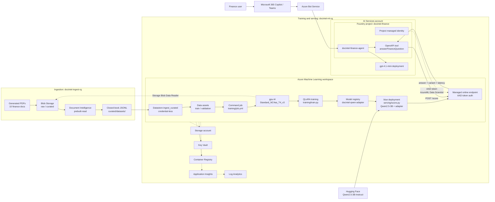
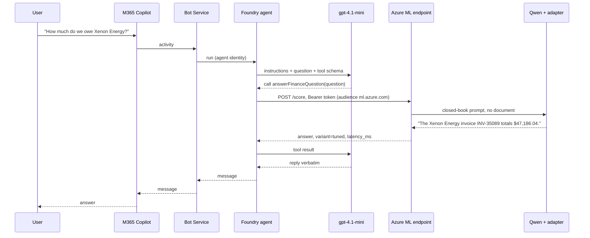

# Architecture

Solid arrows are data or request flow; dashed arrows are identity and
platform dependencies. Training learns the finance facts into a LoRA adapter;
at runtime the Foundry agent uses gpt-4.1-mini only to decide whether to call
the fine-tuned Qwen endpoint, and the answer comes back from the weights.

## Request path

## Identities and roles

| Identity | Role | Scope | Why |
|---|---|---|---|
| `gpu-t4` cluster, workspace | Storage Blob Data Reader | ingestion storage account | training job mounts the JSONL from Blob |
| Foundry project | AzureML Data Scientist | endpoint | the OpenAPI tool scores as the project |
| Agent identity (created by Publish) | Foundry User, AzureML Data Scientist | AI Services account, endpoint | Copilot runs the agent as this identity |
| You | Foundry User | AI Services account | create and test agents from the SDK |

No keys exist anywhere in the path: the ingestion storage account has shared
keys disabled, the endpoint is `aad_token` only, and the agent tool uses
managed-identity auth.

## Repository mapping

| Concern | Location |
|---|---|
| Infrastructure | [`terraform/`](../terraform/) |
| Datastore and data assets | [`data/`](../data/) |
| Training job and QLoRA code | [`training/`](../training/) |
| Endpoint, deployment, scoring | [`serving/`](../serving/) |
| Agent creation and OpenAPI tool | [`agent/`](../agent/) |
| Manual M365 package (alternative) | [`copilot/`](../copilot/) |
